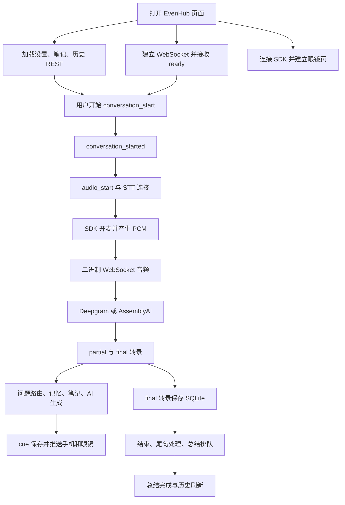

**SayNext EvenHub v2 审计报告 — 2026-09-04**

审计对象是当前工作区的 v0.2.85，Git HEAD 为 `bce9be6`，包括全部现有未提交修改。范围覆盖 EvenHub v2 手机界面、眼镜桥接和渲染、REST、WebSocket、共享 STT、AI 提示、预备笔记、总结、SQLite 和仓库启动/部署配置。没有改动生产代码、原有测试、线上数据或安装包；新增文件是本报告及隔离复现材料。

**主要判断**

现有实现具备可工作的主流程，但不能据当前测试通过就认定能稳定连续使用。问题集中在：身份验证缺失；手机、眼镜、服务器三端状态不一致；异步任务跨会话存活；断线后的恢复不完整；部分设置和界面操作没有落实。

本报告列出 31 项问题，包含条件性缺陷及构建检查问题；另列未完成功能和真机验证边界。P0 表示需要立即处理的数据暴露；P1 表示关键流程、采集控制、保存或数据正确性问题；P2 表示特定条件下的可靠性或功能一致性问题。严重程度不表示每次都会触发。

“已复现”表示在本地隔离环境用可控事件顺序和假服务重现了错误；“公网已验证”表示在现有公网服务执行只读请求得到证据；“代码确认”表示具有明确代码路径，但没有声称已在用户眼镜上发生。公网部署的具体代码版本未得到确认，不能将本地所有缺陷直接等同于线上已发生的故障。

**运行现状与验证结果**

| 检查 | 结果与边界 |
|---|---|
| 本机服务端口 | 检查时 3000、5174 无监听；127.0.0.1:11434 有 Ollama。没有启动或重启用户服务。 |
| 本地配置 | STT 为 Deepgram；全局 LLM_PROVIDER 为 ollama；相关 Key 存在，但未验证有效性。已有 EVENHUB_RELAY_TOKEN，未见 EVENHUB_V2_RELAY_TOKEN。未记录密钥值。 |
| 公网 health | HTTP 200；仅能说明 HTTP 应用响应，不能证明麦克风、STT、AI 正常。 |
| 公网匿名 bootstrap | 无 Cookie、无 Token、陌生 Origin，HTTP 200，CORS 为 *；返回 20 条会话，包含历史 usedPrenote.text。独立 prenotes 数为 0；没有记录私密正文或标识符。 |
| 公网最近 20 条摘要状态 | 17 ready、3 failed；是有限样本，不能据此计算整体失败率或确定失败原因。 |
| 现有前端测试 | 25 文件，136 通过。 |
| 当前源码后端定向测试 | 20 文件，171 通过。覆盖 v2、共享 STT 与 OpenAI JSON 客户端。不是整个 SayNext 仓库所有测试。 |
| 新增前端故障复现 | 3 文件，14 项全部重现。断言的是当前错误行为，通过不等于修复。 |
| 后端流水线探针 | 8 个错误条件重现，使用内存数据库和假 STT/LLM。 |
| 通讯探针 | 复现匿名读写、Token 不一致、close 不结束、恢复不重放、旧连接误控、删除 active 后外键错误。线上仅做只读检查。 |
| 前端 TypeScript | 通过。 |
| 前端生产构建 | 通过；输出到 tmp/evenhub-audit-build，未覆盖原 dist 或 ehpk。 |
| 后端 TypeScript | 失败：evenhub-v2.ts 的 235、241、250 行共 3 个类型错误。 |

测试执行中发现 Bun 不带 `./` 的测试路径会匹配仓库内旧代码镜像；报告只采用随后明确指定当前源码路径的 171 项结果，不混入镜像测试数量。初次 npm 参数传递导致的构建命令错误也已纠正，不计为产品缺陷。

**“打开软件没有开始运行”的具体解释**

当前启动行为是显示首页和眼镜 root_idle，等待手机“开始”或眼镜根页单击；不会打开即自动录音。代码依据是 App 初始 `screen=home`、`isListening=false`，以及 startConversation。这个行为本身应先视为当前设计。

真正需要修复的“按了却没运行”路径包括：取消眼镜退出后进入未启动的 main（F19）；断网排队开始被旧 ready 消息取消（F05）；返回首页后再按开始被 active ID 阻止（F03）；断网结束后服务器旧会话又被接回（F04）；开发重挂载导致事件订阅消失（F21）；Deepgram 已断线但仍被判为 listening（F08）。若补配 v2 Token 而不修改客户端，还会出现 F02 的持续 401。

本机后端未运行只影响指向本地后端的使用方式。已打包客户端默认连公网，而公网当时可达，因此不能只用“本机 3000 未启动”解释眼镜上的所有症状。

**通讯链路检查**



图为预期主流程。实际代码在启动时没有等待 B/C/D 全部就绪，在断线、取消、重启时也没有统一收敛到同一状态。

| 连接或边界 | 当前判定 | 关联问题 |
|---|---|---|
| 手机 → REST | 可响应；公网身份验证失效；失败反馈和请求恢复不足 | F01、F25–F28 |
| 手机 → WebSocket | 正常路径有测试；Token、旧连接、命令重放和恢复状态有缺口 | F02、F04、F05、F12、F13、F29 |
| 页面 → Even SDK | 模拟环境发现订阅及异步绘制竞态；实际宿主与硬件未验证 | F09、F19–F24 |
| SDK PCM → 后端 | 可按代码发送；来源不符仅统计；暂停恢复存在开麦竞态 | F09，真机清单 |
| 后端 → Deepgram | 当前配置路径；断线恢复与会话语言传递有缺陷 | F08、F15 |
| 后端 → AssemblyAI | 现有测试覆盖重连、有界缓冲、语言保持；未连真实账户验证 | 真机/真实服务清单 |
| 后端 → OpenAI | 本地假服务验证发现超时范围和会话结果归属错误 | F06、F07、F10、F16 |
| 后端 → SQLite | 基本 CRUD 测试通过；运行中删除和异常关闭状态有缺陷 | F11、F14、F18 |
| 后端 → 手机/眼镜事件 | 缺少断线补齐；眼镜最新画面可能丢失 | F12、F20 |
| 全局 Ollama 配置 → v2 AI | v2 提示/总结实际走 OpenAI 实现，不能从全局 ollama 推断 v2 使用本地模型 | F30 |
| VPS、代理、DNS、TLS | 公网只读 HTTP 路径当时可达；未登录 VPS 验证代理模式和长连接 | 待验证 |

**逐项问题**

**F01 · P0 · 公网历史和准备材料无身份验证暴露【公网已验证＋隔离复现】**

匿名请求 `/api/evenhub/v2/bootstrap` 实际返回会话以及历史准备材料。REST 只配 `cors(*)`，接口将访问者映射到同一个默认用户；SDK 全局中间件不会强制拒绝无凭证请求。隔离环境套用真实 SDK AppServer 后，匿名读取与修改设置均返回 200，即使配置 v2 relay token 也是如此。删除接口采用相同鉴权路径，但未在线上执行任何写入或删除。

依据：[routes.ts:54](/D:/SayNext/src/server/routes/routes.ts:54)、[API 身份来源:13](/D:/SayNext/src/server/api/evenhub-v2.ts:13)。优先完成 REST/WS 统一强制身份验证、用户归属校验及 Origin 限制。仅缩小 CORS 不能阻止直接请求，不能作为完整修复。

**F02 · P1 · 配置的 Token 与客户端鉴权没有接通【代码确认＋隔离复现】**

本地已有的是 v1 的 EVENHUB_RELAY_TOKEN，v2 只读取 EVENHUB_V2_RELAY_TOKEN。客户端 WS URL 只有 sessionId；REST 也没有应用 Token。因此直接给服务器配置 v2 token，会使 WS 返回 401，而 REST 仍可访问，形成“历史能显示，但不能开始”的状态。客户端每两秒重复连接。公网普通 WS 路径 GET 返回 400，符合越过鉴权后因缺 Upgrade 失败；此次没有建立公网 WS。

依据：[ws.ts:43](/D:/SayNext/src/server/evenhub-v2/ws.ts:43)、[client.ts:242](/D:/SayNext/evenhub-v2/src/evenhub-v2-client.ts:242)、[App.tsx:345](/D:/SayNext/evenhub-v2/src/App.tsx:345)。应同步实现安全的客户端凭证获取与服务器校验，避免把长期秘密硬编码进公开安装包。

**F03 · P1 · 会话中返回首页，录音继续，却无法从手机回到会话【已复现】**

操作：开始并进入 listening → 点击返回 → 点击首页开始。返回只改变 screen，不停止采集；开始函数因为存在 activeConversationId 直接返回。首页没有“返回当前会话”入口，也看不到暂停/结束。复现确认没有发 conversation_end，麦克风也没有收到关闭命令。

依据：[App.tsx:1304](/D:/SayNext/evenhub-v2/src/App.tsx:1304)、[1152](/D:/SayNext/evenhub-v2/src/App.tsx:1152)、[1596](/D:/SayNext/evenhub-v2/src/App.tsx:1596)。首页应明确展示当前会话与采集状态，开始按钮在已有会话时应进入该会话。

**F04 · P1 · 断网时结束指令丢失，重连后首页开始按钮失效【已复现】**

操作：已开始 → WS 断开 → 点结束 → 等重连。发送失败时客户端清掉本地 ID 并回首页，没有保存待发送结束命令。服务器仍保留 active 会话；ready 又把它的 ID 接回来，但 screen 仍为 home、isListening=false。再次开始被 active ID 拦截。

依据：[App.tsx:1187](/D:/SayNext/evenhub-v2/src/App.tsx:1187)、[connection-recovery.ts:31](/D:/SayNext/evenhub-v2/src/connection-recovery.ts:31)。结束需要持久化待确认意图，重连后提交并获得确认。

**F05 · P1 · 离线排队的开始被重连 ready 取消【已复现】**

条件：此前连接成功过，在首页断网，然后点击开始。重连 onopen 发出排队的 conversation_start；服务器 open 时发出的旧 `ready(idle)` 先到，客户端把本地 listening 解释为“旧会话丢失”，清 pending audio 并回首页。随后 conversation_started 到达时已没有待启动音频。复现显示发出了 start，却没有发 audio_start。

依据：[App.tsx:311](/D:/SayNext/evenhub-v2/src/App.tsx:311)、[827](/D:/SayNext/evenhub-v2/src/App.tsx:827)、[852](/D:/SayNext/evenhub-v2/src/App.tsx:852)。新会话启动中与旧会话恢复中必须是不同状态，且绑定请求 ID。

**F06 · P1 · 生成 AI 时结束，后续会话可能永远不再生成【已复现】**

结束时清空 currentAutoJobInput，却未清空 currentAutoJob。旧任务 finally 发现 requestId 不匹配直接返回，清理 job 的代码不执行。下一会话永远被认为已有任务运行。复现中第二会话无提示，generator 调用总数仍是 1，遗留 job 仍存在。

依据：[runtime.ts:1022](/D:/SayNext/src/server/evenhub-v2/runtime.ts:1022)、[1524](/D:/SayNext/src/server/evenhub-v2/runtime.ts:1524)、[875](/D:/SayNext/src/server/evenhub-v2/runtime.ts:875)。需在结束时取消/隔离旧任务并可靠释放队列状态。

**F07 · P1 · 旧会话答案落入新会话【已复现】**

操作：会话 A 的 AI 请求未完成 → 结束 A → 开始 B → A 的结果返回。任务未绑定不可变的 conversationId，发布和存储使用当前 this.conversationId，于是答案写入 B，而关联 attempt 属于 A。复现已经产生这种交叉记录。

依据：[runtime.ts:1249](/D:/SayNext/src/server/evenhub-v2/runtime.ts:1249)、[1281](/D:/SayNext/src/server/evenhub-v2/runtime.ts:1281)、[1484](/D:/SayNext/src/server/evenhub-v2/runtime.ts:1484)。任务输入、回调、落盘和推送都应校验同一个会话及生命周期版本。

**F08 · P1 · Deepgram 断线仍显示 listening，无法恢复且持续积压音频【已复现】**

onclose 只清 socket 并发文本描述，没有使 runtime 进入断线状态，也没有重连。后续 audio_start 因 runtime 仍为 listening 被跳过。pushAudio 将音频放入无上限队列。探针断线后状态仍 listening、新 socket 数为 0、后续 12,800 bytes 全部排队。当前本地配置选择此 provider，因此这条路径直接相关。

依据：[stt.ts:200](/D:/SayNext/src/server/evenhub/stt.ts:200)、[211](/D:/SayNext/src/server/evenhub/stt.ts:211)、[runtime.ts:542](/D:/SayNext/src/server/evenhub-v2/runtime.ts:542)。需要连接状态回传、握手超时、可取消重连及按时长/字节限制的音频缓冲。

**F09 · P1 · 用户暂停/结束后，旧恢复链仍可能重新打开麦克风【已复现】**

恢复流程先 await 关闭，再无条件开启。若用户在等待关闭期间暂停，generation 检查直到两步都结束才执行，无法阻止第二步开麦。复现时界面显示“继续”，最后一次原生命令却是 true。此时 App 因 isListening=false 不转发 PCM；证据是原生采集被要求重开，不能误写为已确认继续上传。

依据：[App.tsx:753](/D:/SayNext/evenhub-v2/src/App.tsx:753)、[758](/D:/SayNext/evenhub-v2/src/App.tsx:758)、[connection-recovery.ts:74](/D:/SayNext/evenhub-v2/src/connection-recovery.ts:74)。在每个异步步骤前核对采集意图与版本，并保证取消后最终命令为关闭。

**F10 · P1 · OpenAI 超时只保护响应头，读取响应体可能永久挂起【已复现】**

fetch 一返回就 clearTimeout 并移除外部 abort 监听，随后才 response.json/text。若响应体迟迟不结束，生成、总结和会话操作没有总超时。探针配置 10ms 超时，35ms 后 body 仍挂起且 signal 未 abort。串行 AI 队列会被占住。

依据：[openai-json-client.ts:110](/D:/SayNext/src/server/local-llm/openai-json-client.ts:110)、[119](/D:/SayNext/src/server/local-llm/openai-json-client.ts:119)、[openai-conversation-client.ts:96](/D:/SayNext/src/server/evenhub-v2/openai-conversation-client.ts:96)。应在包括 body 读取在内的整个请求完成后才释放 timer 和取消监听。

**F11 · P1 · 异常退出/断线清理遗留 active 会话和未清理上游状态【已复现】**

WS 断线默认十分钟后调用 runtime.close 并丢弃 runtime；close 只停计时器和 STT，没有 end/abandon、总结排队或 provider endSession。探针 close 后数据库仍 active、endedAt 为空、summary 为 null、provider end 调用 0 次。进程退出同样没有逐一收尾 v2 runtime。

依据：[ws.ts:98](/D:/SayNext/src/server/evenhub-v2/ws.ts:98)、[runtime.ts:446](/D:/SayNext/src/server/evenhub-v2/runtime.ts:446)、[index.ts:141](/D:/SayNext/src/index.ts:141)。需统一正常结束、TTL 清理、进程退出及下次启动时的恢复策略。

**F12 · P1 · WS 重连只接回 ID，不补齐漏掉的转录、提示或保存通知【已复现】**

断线期间 STT 迟到结果和 AI 任务仍可能写数据库，但消息没有缓存或序号重放；ack 不处理。重新 attach/open 只发 ready，前端也不拉取 active 会话详情。探针数据库已存 1 条转录，恢复时收到消息仅 ready。conversation_saved 丢失还可能导致历史列表不更新。

依据：[runtime.ts:350](/D:/SayNext/src/server/evenhub-v2/runtime.ts:350)、[411](/D:/SayNext/src/server/evenhub-v2/runtime.ts:411)、[1650](/D:/SayNext/src/server/evenhub-v2/runtime.ts:1650)、[App.tsx:809](/D:/SayNext/evenhub-v2/src/App.tsx:809)。需按会话和 serverSeq 补齐事件，或重连后拉快照并去重。

**F13 · P1 · 旧连接仍能控制被新连接接管的会话【已复现】**

attachClient 只替换输出连接；输入消息没有核对 connId 是否当前 owner，也未校验 envelope.conversationId。探针中新连接已经接管，旧连接携带错误 conversationId 的结束命令仍结束了当前会话。多个页面/重叠 WS 时可能错停或混入音频。

依据：[runtime.ts:345](/D:/SayNext/src/server/evenhub-v2/runtime.ts:345)、[359](/D:/SayNext/src/server/evenhub-v2/runtime.ts:359)、[ws.ts:139](/D:/SayNext/src/server/evenhub-v2/ws.ts:139)。需要校验连接归属、会话 ID 与命令幂等性，替换连接时关闭或禁用旧连接。

**F14 · P1 · 删除运行中的会话后，后续保存产生外键错误【已复现】**

删除接口检查 user，但不检查会话是否 active，也不通知 runtime。探针删除成功后 runtime 仍 active，下一条 final transcript 抛 `FOREIGN KEY constraint failed`。另一页面或刷新后的历史可触达这种状态。

依据：[store.ts:494](/D:/SayNext/src/server/evenhub-v2/store.ts:494)。应拒绝直接删除 active/ending 会话，或执行受控停止后再完整删除。

**F15 · P2 · 中文/自动设置没有传到 Deepgram【已复现】**

runtime 传入语言 options，但 Deepgram.start 不接收参数；URL 只读取 EVENHUB_STT_LANGUAGE，默认 en。探针选择 chinese 时线上请求构造仍为 language=en。AssemblyAI 的同类路径已有语言传递实现与测试。

依据：[runtime.ts:562](/D:/SayNext/src/server/evenhub-v2/runtime.ts:562)、[stt.ts:82](/D:/SayNext/src/server/evenhub/stt.ts:82)、[165](/D:/SayNext/src/server/evenhub/stt.ts:165)。需统一 provider 的会话语言接口，真实支持语言/模型组合还应向实际服务验证。

**F16 · P2 · 推测生成和失败回退没有使用选中的预备笔记【已复现】**

canonical provider session 的 seed 有笔记；stateless/推测/fallback prompt 调用无参 buildAutoCueSessionSeed，contextSnapshot 也不含 selectedPrenoteText，但 prenoteUsedIds 仍记录已使用的 IDs。探针唯一笔记标记不在实际上下文和 stateless prompt，使用记录却包含它。

依据：[context-adapter.ts:542](/D:/SayNext/src/server/evenhub-v2/context-adapter.ts:542)、[569](/D:/SayNext/src/server/evenhub-v2/context-adapter.ts:569)、[auto-cue-generator.ts:217](/D:/SayNext/src/server/evenhub-v2/auto-cue-generator.ts:217)、[482](/D:/SayNext/src/server/evenhub-v2/auto-cue-generator.ts:482)。需保证所有生成路径使用相同材料，并只标记实际发送给模型的内容。

**F17 · P2 · 队列中重复问题阻塞后续不同问题【已复现】**

A 正在生成 → 再次说 A → 说 B。A 完成后队列取出重复 A，hash 分支直接 return，没有继续取 B 或安排下一次执行。探针 B 留在队列，但没有 active job，必须等另一个外部 flush。

依据：[runtime.ts:881](/D:/SayNext/src/server/evenhub-v2/runtime.ts:881)。重复项应跳过后继续 drain，不能终止整条工作队列。

**F18 · P2 · 总结重启恢复与失败重试不完整【部分复现＋代码确认】**

服务启动只恢复已超过默认十分钟的 running 总结。刚启动不久的总结遇到进程重启时尚未 stale，错过唯一恢复机会；之后没有周期 sweep，可能永久 running。探针将阈值缩短后验证越过阈值仍不恢复。启动还只获取前 100 个 queued，没有继续消费剩余积压。

已有 failed 总结也无重新排队入口：API 看到现有 summary 直接返回，前端仅轮询 queued/running。公网有限样本中 3 条 failed 证明存在失败状态，但未读取具体失败原因，不能归因为本项中的某一种原因。

依据：[index.ts:83](/D:/SayNext/src/index.ts:83)、[summary-runner.ts:91](/D:/SayNext/src/server/evenhub-v2/summary-runner.ts:91)、[API:118](/D:/SayNext/src/server/api/evenhub-v2.ts:118)、[App.tsx:365](/D:/SayNext/evenhub-v2/src/App.tsx:365)。需实现定期恢复、持续拉取、幂等重试和用户可操作的失败重试。

**F19 · P2 · 眼镜取消退出后进入没有录音的主界面【已复现】**

root_idle 双击进入退出确认，单击取消被固定转到 main/effect:none，没有 conversation_start 或开麦。main 单击进入菜单，无法再从眼镜按正常根页行为开始。必须使用手机或重新进入 idle。

依据：[glasses-state.ts:157](/D:/SayNext/evenhub-v2/src/glasses-state.ts:157)、[App.tsx:1042](/D:/SayNext/evenhub-v2/src/App.tsx:1042)。退出确认应保存来源视图，取消回来源，且视图与会话状态保持一致。

**F20 · P2 · 初始化补绘期间到达的新页面丢失【已复现】**

建立 bridge 后先抓取 latestPage，再 await 补绘；等待中到达 cue/转录/结束只会设置 pending。完成后直接清 pending，并继续使用旧 latestPage，未重新读取最新 ref。复现中手机已收到 cue，原生页却没有收到包含它的更新。

依据：[App.tsx:434](/D:/SayNext/evenhub-v2/src/App.tsx:434)、[440](/D:/SayNext/evenhub-v2/src/App.tsx:440)、[452](/D:/SayNext/evenhub-v2/src/App.tsx:452)。初始化和普通渲染应使用同一个串行调度器，绘制完成后继续消费最新版本。

**F21 · P2 · 并发桥接乱序返回会删除最新 SDK 订阅【已复现，条件性】**

两个 startup 请求先后开始、后者先完成；旧请求后来订阅时先销毁当前新订阅，随后又被 App generation guard dispose，最终订阅为零，手势与 PCM 都不再进入 App。开发 StrictMode 的双 effect 可制造条件。

依据：[main.tsx:8](/D:/SayNext/evenhub-v2/src/main.tsx:8)、[glasses-bridge.ts:297](/D:/SayNext/evenhub-v2/src/glasses-bridge.ts:297)、[388](/D:/SayNext/evenhub-v2/src/glasses-bridge.ts:388)、[App.tsx:429](/D:/SayNext/evenhub-v2/src/App.tsx:429)。生产 build 不因 StrictMode 自动双执行；生产需同一 SDK singleton 下确有并发连接/重挂载才适用，不能泛称所有生产启动必现。

**F22 · P2 · 关闭自动弹窗仍自动显示 AI【已复现】**

autoPopup 可修改和保存，但不进入眼镜页面构建；cue_created 无条件设可见期限。设置 false 后测试仍看到 AI 内容被发送到主屏。

依据：[App.tsx:217](/D:/SayNext/evenhub-v2/src/App.tsx:217)、[921](/D:/SayNext/evenhub-v2/src/App.tsx:921)、[1364](/D:/SayNext/evenhub-v2/src/App.tsx:1364)、[glasses-layout.ts:370](/D:/SayNext/evenhub-v2/src/glasses-layout.ts:370)。自动展示与主动打开详情应分别遵守明确规则。

**F23 · P2 · 5/10/15 秒提示不会按时消失【已复现】**

期限仅在构建页面时用 Date.now 判定，没有到期 timer；useMemo 不随 elapsedSeconds 重算。安静/暂停后没有新事件，提示持续显示。测试推进六秒，五秒提示仍没有任何对应刷新。

依据：[App.tsx:217](/D:/SayNext/evenhub-v2/src/App.tsx:217)、[glasses-layout.ts:370](/D:/SayNext/evenhub-v2/src/glasses-layout.ts:370)。需要可取消的到期刷新，且新 cue 替换旧 cue 时更新对应 timer。

**F24 · P2 · 音频首包迟到后，“无音频”错误不会消失【已复现】**

三秒超时先清 timer ref，再设置 no_audio；晚到 PCM 只有 timer ref 非空才清 client error。复现 PCM 已正常发送，状态仍是 g2_mic_no_audio。手机源同理，会误导用户认为软件没运行。

依据：[App.tsx:633](/D:/SayNext/evenhub-v2/src/App.tsx:633)、[682](/D:/SayNext/evenhub-v2/src/App.tsx:682)。错误恢复应依据音频事实，而不是 timer 是否存在。

**F25 · P2 · 初始资料未加载就可以开始，预备笔记漏用【已复现】**

loadBootstrap 与 WS、开始按钮相互独立；settingsReady 没有阻止开始。用户在慢网下先开始，发出的 selectedPrenoteIds/text 为空；之后笔记出现在界面，却没有补入当前会话。探针确认 start 只发送了一次且不含已保存笔记。

依据：[App.tsx:266](/D:/SayNext/evenhub-v2/src/App.tsx:266)、[1151](/D:/SayNext/evenhub-v2/src/App.tsx:1151)、[1596](/D:/SayNext/evenhub-v2/src/App.tsx:1596)。应在开始前完成所需初始化，或明确允许用户选择无材料启动，并锁定本次快照。

**F26 · P2 · 初始化和保存失败缺乏可见反馈与重试【部分复现＋代码确认】**

bootstrap 失败仅写 connectionStatus，而状态只在 live 页显示；首页表现为空列表，没有错误或重试。ready/reconnect 不重新加载 bootstrap。探针失败后回 ready 仍只调用过一次 bootstrap。settings 保存错误被吞掉；笔记保存失败虽然设置状态，但 noteEditor 不展示，按钮恢复后用户不知道失败原因。fetch 也没有应用层超时，挂起时可能长期停在等待状态。

依据：[App.tsx:255](/D:/SayNext/evenhub-v2/src/App.tsx:255)、[284](/D:/SayNext/evenhub-v2/src/App.tsx:284)、[1125](/D:/SayNext/evenhub-v2/src/App.tsx:1125)、[1469](/D:/SayNext/evenhub-v2/src/App.tsx:1469)、[client.ts:257](/D:/SayNext/evenhub-v2/src/evenhub-v2-client.ts:257)。需要各操作自己的 loading/error/retry 状态，避免一个 connectionStatus 字符串覆盖所有故障。

**F27 · P2 · 较早的历史请求覆盖较新的用户选择【已复现】**

打开 A → 返回 → 打开 B → B 先加载 → A 晚到。A 的 then 无条件 setActiveRecordId(A)，使界面从 B 跳到 A。轮询也没有完整取消正在执行的请求，存在同类风险。

依据：[App.tsx:1249](/D:/SayNext/evenhub-v2/src/App.tsx:1249)、[365](/D:/SayNext/evenhub-v2/src/App.tsx:365)。更新前核对当前选择/request generation，或取消旧请求。

**F28 · P2 · localStorage 读取被拒绝会让启动直接进入错误页【已复现，条件性】**

loadStoredConversationSettings 的 getItem 在 try/catch 外；宿主禁用存储或抛 SecurityError 时，初次 render 直接抛错。保存函数对 getter 的保护也不完整。复现模拟存储读取被拒绝，启动读取确实抛异常。正常允许存储的设备不受此条件影响。

依据：[settings-storage.ts:48](/D:/SayNext/evenhub-v2/src/settings-storage.ts:48)、[App.tsx:142](/D:/SayNext/evenhub-v2/src/App.tsx:142)。整个存储访问应可降级到内存/默认配置。

**F29 · P2 · WebView 刷新/重建不恢复原会话【代码确认】**

getOrCreateClientSessionId 虽支持传 storage，但 App 无参调用时仅使用模块变量；刷新后 ID 改变，无法命中十分钟 runtime 缓存。客户端初次 ready 也不接管现有服务器会话。结合 F11 会遗留旧 active 记录。

依据：[client.ts:123](/D:/SayNext/evenhub-v2/src/evenhub-v2-client.ts:123)、[App.tsx:150](/D:/SayNext/evenhub-v2/src/App.tsx:150)、[connection-recovery.ts:21](/D:/SayNext/evenhub-v2/src/connection-recovery.ts:21)。需明确页面实例与会话恢复凭证的生命周期，避免简单共享一个永久 ID 又引入多页面接管。

**F30 · P1 · 仓库 Docker 部署缺 v2 依赖配置，health 不能发现【代码确认，条件性部署问题】**

Compose 未传 STT provider/Key、OPENAI_API_KEY，也没有 env_file；.env 被镜像构建排除。由该配置直接启动时，STT adapter 缺 Key，v2 OpenAI 提示/总结同样缺 Key。Compose 的 LLM_PROVIDER=ollama 不会让 v2 的 OpenAI 实现改走 Ollama。health 固定返回 ok，也不检查这些依赖。

依据：[docker-compose.yml:11](/D:/SayNext/docker-compose.yml:11)、[.dockerignore](/D:/SayNext/.dockerignore)、[stt.ts:688](/D:/SayNext/src/server/evenhub/stt.ts:688)、[openai-json-client.ts:57](/D:/SayNext/src/server/local-llm/openai-json-client.ts:57)、[health.ts:4](/D:/SayNext/src/server/api/health.ts:4)。这是仓库部署路径缺陷，未确认当前公网采用该 Compose。应按实际 v2 依赖补齐配置与 readiness 检查，展示 v2 实际 provider。

**F31 · P2 · 后端当前不能通过 TypeScript 检查【工具实测】**

`body.text`、`body.title` 在条件分支后仍被推断为 unknown；selected 同样无法赋给 boolean。错误分别是 TS18046、TS18046、TS2322。Bun 运行和现有 API 测试通过，因此不能把这三条类型错误直接说成已发生的运行崩溃；但会阻断加入类型检查的构建/CI。

依据：[API:235](/D:/SayNext/src/server/api/evenhub-v2.ts:235)、[241](/D:/SayNext/src/server/api/evenhub-v2.ts:241)、[250](/D:/SayNext/src/server/api/evenhub-v2.ts:250)。使用经验证的局部变量或明确的 schema 返回类型。

**另列：功能没有完成或存在明确限制**

| 功能 | 当前事实 | 依据 |
|---|---|---|
| 眼镜确认退出 | state machine 产生 exit_confirm effect，App 未处理；未调用 SDK shutDownPageContainer。确认目前只是回 idle。 | [glasses-state.ts:160](/D:/SayNext/evenhub-v2/src/glasses-state.ts:160)、[App.tsx:1042](/D:/SayNext/evenhub-v2/src/App.tsx:1042) |
| 长笔记/长代码详情 | 手机笔记可输入 5000 字符，眼镜笔记页截到 920；文本升级截到 2000，后续内容无应用分页入口。应区别“服务端保存完整”与“眼镜可读完整”。 | [glasses-layout.ts:359](/D:/SayNext/evenhub-v2/src/glasses-layout.ts:359)、[glasses-bridge.ts:355](/D:/SayNext/evenhub-v2/src/glasses-bridge.ts:355) |
| 实时会话时间/地点 | 手机 live 标题写死为 01:35 PM 2026/06/05、哈利法克斯，未使用真实会话数据。 | [App.tsx:1468](/D:/SayNext/evenhub-v2/src/App.tsx:1468) |
| 眼镜时钟 | h-right 内容变化从结构比较排除，renderer 没有对应 header 单独刷新；通常需新 cue/切页整页重建才更新。 | [glasses-render-plan.ts:3](/D:/SayNext/evenhub-v2/src/glasses-render-plan.ts:3) |
| 分享至速记/行动项选择 | 当前是 span/article 展示，没有分享或切换处理；选择数量固定写总数/总数。不能把 checked=true 直接解释为任务已完成。 | [App.tsx:1687](/D:/SayNext/evenhub-v2/src/App.tsx:1687) |
| 历史 More、首页 Main | 按钮没有操作 handler。 | [App.tsx:1511](/D:/SayNext/evenhub-v2/src/App.tsx:1511)、[1533](/D:/SayNext/evenhub-v2/src/App.tsx:1533) |
| 自动语言入口 | 类型与加载支持 auto，手机语言按钮只循环 english/chinese，不能主动选 auto。 | [App.tsx:1333](/D:/SayNext/evenhub-v2/src/App.tsx:1333) |
| 笔记附件 | 当前 UI 明示只支持文字，服务端 files=[]；属于尚未实现的能力，不能把已明示的文字版限制当成隐藏故障。 | [App.tsx:1407](/D:/SayNext/evenhub-v2/src/App.tsx:1407)、[API:57](/D:/SayNext/src/server/api/evenhub-v2.ts:57) |

**另列：AI 准确性与故障提示的边界**

- speculative 提示已经发布后，final ASR 即使修正问题，也会因 publishedSpeculativeTurnIds 提前返回，不重新纠正已发答案。这是当前“一轮一个即时提示”的选择，实际会牺牲某些修正机会。依据：[runtime.ts:807](/D:/SayNext/src/server/evenhub-v2/runtime.ts:807)。
- 总结只使用 final transcript；结束残留 partial 写入 lastPartialAtEnd，但不进入总结。它有现有测试保障，是事实边界；当上游没有发出尾句 final 时，用户仍会感到最后一句缺失。依据：[runtime.ts:1508](/D:/SayNext/src/server/evenhub-v2/runtime.ts:1508)、[summary-runner.ts:115](/D:/SayNext/src/server/evenhub-v2/summary-runner.ts:115)。
- AI 生成失败主要写 attempt，不主动向前端发送独立的 AI 失败/可重试状态。STT 仍正常时界面可能只表现为没有提示。依据：[runtime.ts:1175](/D:/SayNext/src/server/evenhub-v2/runtime.ts:1175)。

**修复次序及验收标准**

1. 先关闭匿名数据访问路径：REST 与 WS 都要识别用户并校验归属，错误凭证应一致失败。验收不仅检查 CORS，还要用无凭证直接请求验证读写均被拒绝。
2. 收拢会话状态机：明确 idle、starting、listening、paused、recovering、stopping、failed；区分用户期望状态和实际连接状态。修复 F03–F07、F09、F11、F13、F14，确保旧命令与旧结果不能作用于新会话。
3. 修复实时通讯：Deepgram 断线、语言、连接超时、有界缓冲；所有 OpenAI 请求覆盖响应体的超时；WS 快照/事件补齐。界面应分别显示后端、眼镜、麦克风、STT 和 AI 的状态。
4. 修复材料和后台作业：所有生成路径使用一致的选中笔记；重复问题不阻塞队列；总结持续消费并可重试、重启可恢复。
5. 完成手机/眼镜操作闭环：初始化就绪、当前会话入口、错误反馈、退出、提示开关/时长、长内容分页、历史请求取消、真实时间。
6. 最后完成下面的真机矩阵，再判断可否作为稳定版本。现有通过测试须保留，本次复现测试应在修复时改成断言预期正确行为，而不是继续断言 bug。

**仍需真机或真实服务验证**

| 场景 | 必须观察的结果 |
|---|---|
| G2/R1 与手机冷启动、SDK 晚就绪 | 根页能操作；只建立一份有效事件订阅；启动状态可见。 |
| 选择手机麦克风与眼镜麦克风 | 实际 PCM 来源、采样率、声道正确；权限拒绝与首包延迟可恢复。现在来源不匹配只计数，未阻止转发。 |
| 持续对话后锁屏、切后台、回前台 | 回前台后只有一条采集链；暂停/结束具有最高优先级。 |
| Wi-Fi/蜂窝切换、断网前后开始/暂停/结束 | 指令最终一致；无重复会话、无隐藏采集；漏掉的转录和提示补齐。 |
| 长时间安静、长会话、连续多会话 | STT keepalive/重连、队列长度、内存与 AI 请求数有界；第二场以后继续生成。 |
| 中英文和混合语言真实语音 | 每个 provider 的账户/模型确实支持选项；不只检验 URL 字段。 |
| 真正的 OpenAI 慢响应、失败和取消 | 不无限等待；失败在前端可见；旧答案不串会话；选中笔记在所有路径有效。 |
| 眼镜滚动与 Unicode 长内容 | 长代码、中文、组合字符可完整阅读；原生文本限额及滚动行为正确。 |
| 手机强退、WebView 重建、服务端重启 | 会话可恢复或可解释地结束；active 记录和总结无遗留；上游会话被清理。 |
| Local/VPS 切换与 SQLite 同步 | 核实当前唯一主库及备份流程；本次没有执行数据库同步、远端部署或主库切换。 |

本次没有连接真实眼镜、开启真实麦克风、调用收费 STT/LLM 或登录 VPS。因此可以确认上述代码错误和有限公网暴露，不能声称所有硬件通讯已检验通过，也不能保证已穷尽全部潜在 bug。

**复现材料与命令**

前端复现位于 [phone-flow.audit.test.tsx](/D:/SayNext/evenhub-v2/.audit/phone-flow.audit.test.tsx)、[glasses-audit.test.tsx](/D:/SayNext/evenhub-v2/.audit/glasses-audit.test.tsx)、[glasses-bridge-race-audit.test.ts](/D:/SayNext/evenhub-v2/.audit/glasses-bridge-race-audit.test.ts)。在 D:\SayNext\evenhub-v2 运行：

```powershell
node node_modules/vitest/vitest.mjs run .audit --reporter=verbose
```

后端探针在 [audit-pipeline-20260904.ts](/D:/SayNext/tmp/audit-pipeline-20260904.ts) 和 [audit-transport-20260904.ts](/D:/SayNext/tmp/audit-transport-20260904.ts)。在 D:\SayNext 运行：

```powershell
bun ./tmp/audit-pipeline-20260904.ts
bun ./tmp/audit-transport-20260904.ts
```

安全公网摘要：[audit-public-20260904.json](/D:/SayNext/tmp/audit-public-20260904.json)。其内容只有状态、字段名和数量，没有私密正文。

其余日志：[前端基线](/D:/SayNext/tmp/evenhub-audit-frontend-tests.log)、[当前后端基线](/D:/SayNext/tmp/evenhub-audit-backend-current-tests.log)、[前端复现](/D:/SayNext/tmp/evenhub-audit-all-repros.log)、[后端流水线](/D:/SayNext/tmp/audit-pipeline-20260904.log)、[通讯复现](/D:/SayNext/tmp/audit-transport-20260904.log)、[后端类型错误](/D:/SayNext/tmp/evenhub-audit-backend-types.log)、[构建结果](/D:/SayNext/tmp/evenhub-audit-build.log)。
